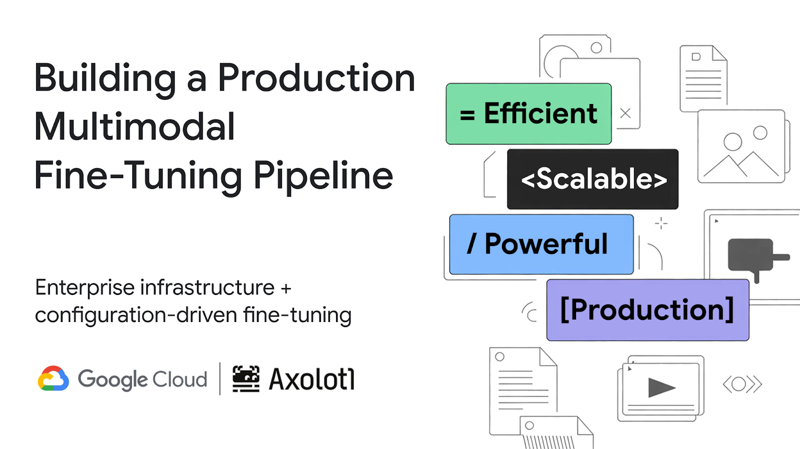
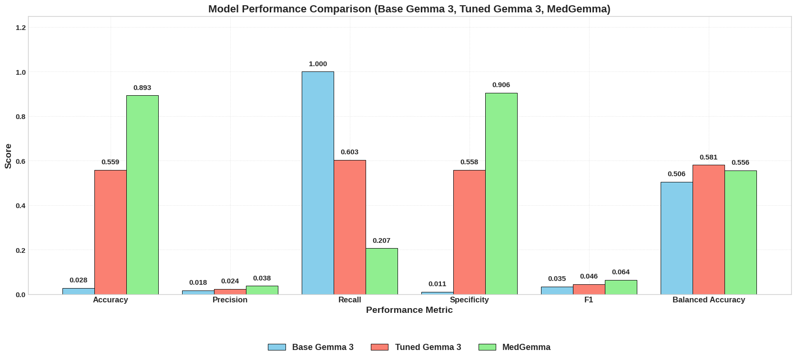

<br/>
<br/>

## Multimodal Fine-tuning with Gemma 3 and Axolotl for Melanoma Detection

This repository demonstrates how to fine-tune Gemma 3, a multimodal AI model, on the SIIM-ISIC Melanoma Classification dataset using Axolotl and Google Kubernetes Engine (GKE). The implementation provides a complete pipeline for preparing medical imaging data, fine-tuning with modern cloud-native practices, and evaluating model performance.

> **Note**: This hands-on example contains medical imagery and discussion of benign and malignant cancer. The content is intended for educational and research purposes.

<br/>
<br/>



## 🚀 Overview

Medical imaging applications require specialized knowledge that general-purpose AI models may lack. This repository shows how domain-specific fine-tuning can transform Gemma 3 into a model with enhanced capabilities for dermatological image analysis, specifically for melanoma detection.

### Key Features

- **Modern Cloud-Native Implementation**: Uses Workload Identity Federation for secure, keyless authentication
- **Production-Ready Infrastructure**: GKE Autopilot mode for automated GPU provisioning and scaling
- **Efficient Fine-tuning**: QLoRA with 4-bit quantization for memory-efficient training
- **Comprehensive Evaluation**: Includes comparison with base model and MedGemma
- **Complete Pipeline**: From data preparation to model deployment

## 📋 Prerequisites

Before starting, ensure you have:

### Required Access
- Google Cloud account with billing enabled
- Hugging Face account with access to Gemma 3 models
- Sufficient quota for A100 GPUs in your selected region

### Tools & CLI
```bash
# Install required tools
gcloud components install kubectl
gcloud components install gke-gcloud-auth-plugin

# Verify installations
gcloud version
kubectl version --client
```

### Python Environment
```bash
# Create a virtual environment
python -m venv venv
source venv/bin/activate  # On Windows: venv\Scripts\activate

# Install required packages
pip install jupyter notebook pandas numpy scikit-learn matplotlib seaborn
```

## 🏗️ Repository Structure

```
gke-multimodal-fine-tune-gemma-3-axolotl/
├── README.md                      # This file
├── data/
│   └── DataPreparation.ipynb      # Dataset preparation for Axolotl format
├── config/
│   └── gemma3-melanoma.yaml       # Axolotl fine-tuning configuration
├── k8s/                           # Kubernetes manifests
│   ├── model-storage-pvc.yaml     # Persistent volume claim
│   ├── axolotl-training-job.yaml  # Training job with Workload Identity
│   ├── tensorboard.yaml           # TensorBoard deployment
│   └── model-export.yaml          # Model export pod
├── evaluation/
│   └── Evaluation.ipynb           # Model evaluation and comparison
├── scripts/                       # Helper scripts
│   ├── setup-cluster.sh           # Automated cluster setup
│   ├── setup-workload-identity.sh # Workload Identity configuration
│   └── deploy-training.sh         # Training deployment script
└── img/                           # Documentation images
    ├── architecture/              # Architecture diagrams
    └── results/                   # Performance visualizations
```

## 🚀 Quick Start

### 1. Initial Setup

```bash
# Clone the repository
git clone https://github.com/ayoisio/gke-multimodal-fine-tune-gemma-3-axolotl.git
cd gke-multimodal-fine-tune-gemma-3-axolotl

# Set up environment variables
export PROJECT_ID=$(gcloud config get-value project)
export REGION=us-central1
export GCS_BUCKET_NAME="${PROJECT_ID}-melanoma-dataset"
export HF_TOKEN="YOUR_HUGGING_FACE_TOKEN"  # Get from https://huggingface.co/settings/tokens

# Enable required APIs
gcloud services enable container.googleapis.com
gcloud services enable storagetransfer.googleapis.com
gcloud services enable compute.googleapis.com
```

### 2. Create Storage Bucket

```bash
# Create GCS bucket for dataset and models
gcloud storage buckets create gs://${GCS_BUCKET_NAME} \
    --location=${REGION} \
    --uniform-bucket-level-access
```

### 3. Run Complete Setup

```bash
# Make scripts executable
chmod +x scripts/*.sh

# Run automated setup (creates cluster, configures Workload Identity, etc.)
./scripts/setup-cluster.sh
```

## 📊 Implementation Steps

### Step 1: Data Preparation

We use Google Cloud Storage Transfer Service for efficient data transfer.

#### Transfer Dataset to Cloud Storage

```bash
# Create TSV file with dataset URLs
cat > melanoma_dataset_urls.tsv << EOF
TsvHttpData-1.0
https://isic-challenge-data.s3.amazonaws.com/2020/ISIC_2020_Training_JPEG.zip
https://isic-challenge-data.s3.amazonaws.com/2020/ISIC_2020_Training_GroundTruth.csv
https://isic-challenge-data.s3.amazonaws.com/2020/ISIC_2020_Training_GroundTruth_v2.csv
https://isic-challenge-data.s3.amazonaws.com/2020/ISIC_2020_Test_JPEG.zip
https://isic-challenge-data.s3.amazonaws.com/2020/ISIC_2020_Test_Metadata.csv
EOF

# Upload to bucket
gcloud storage cp melanoma_dataset_urls.tsv gs://${GCS_BUCKET_NAME}/

# Set up Storage Transfer Service permissions
export PROJECT_NUMBER=$(gcloud projects describe ${PROJECT_ID} --format="value(projectNumber)")
export STS_SERVICE_ACCOUNT="project-${PROJECT_NUMBER}@storage-transfer-service.iam.gserviceaccount.com"

# Grant permissions
gcloud storage buckets add-iam-policy-binding gs://${GCS_BUCKET_NAME} \
    --member=serviceAccount:${STS_SERVICE_ACCOUNT} \
    --role=roles/storage.objectViewer

gcloud storage buckets add-iam-policy-binding gs://${GCS_BUCKET_NAME} \
    --member=serviceAccount:${STS_SERVICE_ACCOUNT} \
    --role=roles/storage.objectUser
```

Then create a Storage Transfer job via the Console to download ~32GB of data.

#### Format Data for Axolotl

```bash
# Run the data preparation notebook
jupyter notebook data/DataPreparation.ipynb
```

The notebook processes images into Axolotl's chat template format:

```json
{
  "messages": [
    {
      "role": "system",
      "content": [
        {"type": "text", "text": "You are a dermatology assistant that helps identify potential melanoma from skin lesion images."}
      ]
    },
    {
      "role": "user",
      "content": [
        {"type": "image", "path": "/path/to/image.jpg"},
        {"type": "text", "text": "Does this appear to be malignant melanoma?"}
      ]
    },
    {
      "role": "assistant", 
      "content": [
        {"type": "text", "text": "Yes, this appears to be malignant melanoma."}
      ]
    }
  ]
}
```

### Step 2: GKE Cluster Setup with Autopilot

Create a GKE Autopilot cluster optimized for ML workloads:

```bash
# Create cluster (if not already done by setup script)
gcloud container clusters create-auto melanoma-training-cluster \
    --location=${REGION} \
    --project=${PROJECT_ID} \
    --release-channel=regular

# Get credentials
gcloud container clusters get-credentials melanoma-training-cluster \
    --location=${REGION} \
    --project=${PROJECT_ID}
```

### Step 3: Configure Workload Identity Federation

Set up secure, keyless authentication for GKE workloads:

```bash
# Run the Workload Identity setup script
./scripts/setup-workload-identity.sh

# Or manually:
export NAMESPACE="axolotl-training"
export KSA_NAME="axolotl-training-sa"
export GSA_NAME="axolotl-training-sa"

# Create namespace
kubectl create namespace ${NAMESPACE}

# Create Kubernetes ServiceAccount
kubectl create serviceaccount ${KSA_NAME} --namespace=${NAMESPACE}

# Create Google Service Account
gcloud iam service-accounts create ${GSA_NAME} \
    --display-name="Axolotl Training Service Account"

# Grant permissions
gcloud projects add-iam-policy-binding ${PROJECT_ID} \
    --member="serviceAccount:${GSA_NAME}@${PROJECT_ID}.iam.gserviceaccount.com" \
    --role="roles/storage.objectAdmin"

# Enable Workload Identity
gcloud iam service-accounts add-iam-policy-binding \
    ${GSA_NAME}@${PROJECT_ID}.iam.gserviceaccount.com \
    --role="roles/iam.workloadIdentityUser" \
    --member="serviceAccount:${PROJECT_ID}.svc.id.goog[${NAMESPACE}/${KSA_NAME}]"

# Annotate ServiceAccount
kubectl annotate serviceaccount ${KSA_NAME} \
    --namespace=${NAMESPACE} \
    iam.gke.io/gcp-service-account=${GSA_NAME}@${PROJECT_ID}.iam.gserviceaccount.com
```

### Step 4: Deploy Training Resources

```bash
# Create persistent storage
kubectl apply -f k8s/model-storage-model-storage-pvc.yaml

# Create ConfigMap with training configuration
kubectl create configmap axolotl-config \
    --from-file=config/gemma3-melanoma.yaml \
    -n ${NAMESPACE}

# Create Hugging Face credentials secret
kubectl create secret generic huggingface-credentials \
    -n ${NAMESPACE} \
    --from-literal=token=${HF_TOKEN}

# Deploy training job
envsubst < k8s/axolotl-training-job.yaml | kubectl apply -f -
```

### Step 5: Monitor Training Progress

```bash
# Get pod name
POD_NAME=$(kubectl get pods -n ${NAMESPACE} \
    --selector=job-name=gemma3-melanoma-training \
    -o jsonpath='{.items[0].metadata.name}')

# Watch logs
kubectl logs -f ${POD_NAME} -n ${NAMESPACE}

# Deploy TensorBoard
kubectl apply -f k8s/tensorboard.yaml

# Get TensorBoard URL
kubectl get service tensorboard -n ${NAMESPACE}
```

### Step 6: Export and Evaluate Model

```bash
# Export model to GCS
kubectl apply -f k8s/model-export.yaml

# Monitor export progress
kubectl logs model-export -n ${NAMESPACE}

# Run evaluation notebook
jupyter notebook evaluation/Evaluation.ipynb
```

## 📈 Performance Results

Our fine-tuned model demonstrated significant improvements over the base Gemma 3:

| Metric | Base Gemma 3 | Fine-tuned | MedGemma | Improvement (vs Base) |
|--------|--------------|------------|----------|----------------------|
| **Accuracy** | 0.028 | 0.559 | 0.893 | +1870.2% |
| **Precision** | 0.018 | 0.024 | 0.038 | +34.2% |
| **Recall** | 1.000 | 0.603 | 0.207 | -39.7% |
| **Specificity** | 0.011 | 0.558 | 0.906 | +4947.2% |
| **Balanced Accuracy** | 0.506 | 0.581 | 0.556 | +14.8% |

### Key Findings

- **Base Model**: Over-diagnosed melanoma (perfect recall, poor specificity)
- **Fine-tuned Model**: Balanced performance with dramatically reduced false positives
- **MedGemma**: Strong overall performance but still benefits from task-specific tuning


## 🔧 Configuration Details

### Axolotl Training Configuration

Our configuration uses QLoRA with 4-bit quantization for efficient fine-tuning:

```yaml
# Key parameters from gemma3-melanoma.yaml
load_in_4bit: true
adapter: qlora
lora_r: 32
lora_alpha: 16
sequence_len: 4096
micro_batch_size: 1
gradient_accumulation_steps: 4
learning_rate: 2e-5
max_steps: 1000
```

### Hardware Requirements

- **GPU**: NVIDIA A100 40GB (minimum)
- **Memory**: 32GB RAM
- **Storage**: 100GB for model outputs
- **Ephemeral Storage**: 10GB for temporary files

## 🐛 Troubleshooting

### Common Issues and Solutions

#### 1. GCS FUSE Mounting Issues
```bash
# Verify GCS FUSE CSI driver is installed
kubectl get csidriver gcsfuse.csi.storage.gke.io

# Check pod events for mounting errors
kubectl describe pod ${POD_NAME} -n ${NAMESPACE}
```

#### 2. GPU Allocation Failures
```bash
# Check node pool GPU availability
kubectl get nodes -o custom-columns=NAME:.metadata.name,GPUs:.status.capacity.nvidia\\.com/gpu

# Verify GPU quota in region
gcloud compute project-info describe --project=${PROJECT_ID}
```

#### 3. Workload Identity Issues
```bash
# Verify ServiceAccount annotation
kubectl get serviceaccount ${KSA_NAME} -n ${NAMESPACE} -o yaml

# Test authentication
kubectl run -it --rm debug \
    --image=google/cloud-sdk:slim \
    --serviceaccount=${KSA_NAME} \
    -n ${NAMESPACE} \
    -- gsutil ls gs://${GCS_BUCKET_NAME}/
```

#### 4. Missing Adapter Files
```bash
# List model files in GCS
gsutil ls -l gs://${GCS_BUCKET_NAME}/tuned-models/

# Ensure adapter_config.json and adapter_model.safetensors exist
```

## 🤝 Contributing

We welcome contributions! Please:

1. Fork the repository
2. Create a feature branch (`git checkout -b feature/AmazingFeature`)
3. Commit your changes (`git commit -m 'Add some AmazingFeature'`)
4. Push to the branch (`git push origin feature/AmazingFeature`)
5. Open a Pull Request

## 📚 Resources

### Documentation
- [Axolotl Multimodal Guide](https://docs.axolotl.ai/docs/multimodal.html)
- [GKE Autopilot Documentation](https://cloud.google.com/kubernetes-engine/docs/concepts/autopilot-overview)
- [Workload Identity Federation](https://cloud.google.com/iam/docs/workload-identity-federation)
- [Gemma 3 Technical Documentation](https://ai.google.dev/gemma/docs/core)

### Related Projects
- [MedGemma on Hugging Face](https://huggingface.co/google/medgemma-4b-it)
- [SIIM-ISIC Melanoma Challenge](https://challenge2020.isic-archive.com/)

### Community & Support
- [Axolotl Discord](https://discord.com/invite/HhrNrHJPRb)
- [Google Cloud Community](https://cloud.google.com/communities)
- Open an issue in this repository

## 🙏 Acknowledgments

- Google Cloud team for infrastructure support
- Axolotl community for the fine-tuning framework
- ISIC for providing the melanoma dataset

## ⚠️ Disclaimer

This project is for educational and research purposes only. The models and code provided should not be used for actual medical diagnosis without proper validation and regulatory approval. Always consult qualified healthcare professionals for medical decisions.

---

**Last Updated**: May 2025
